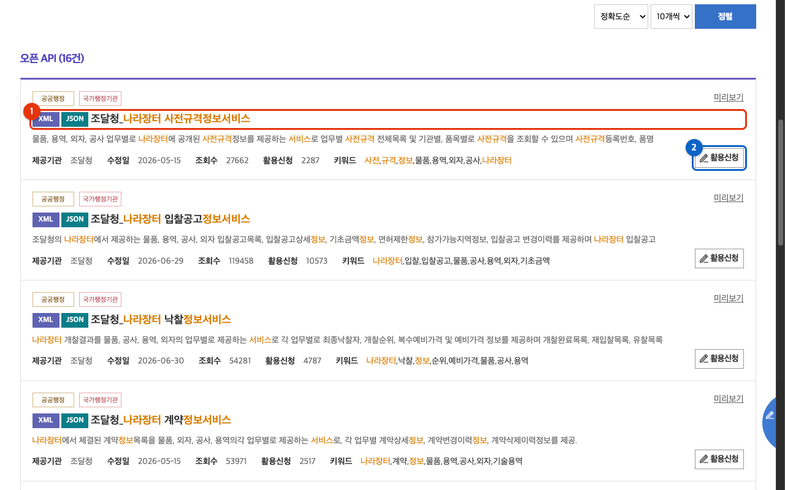
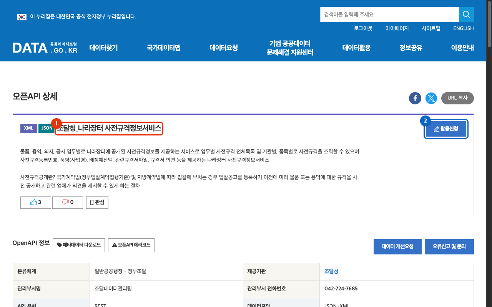
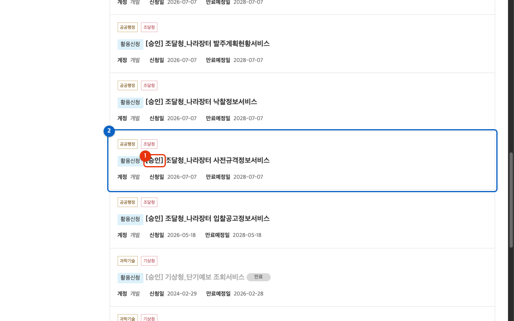
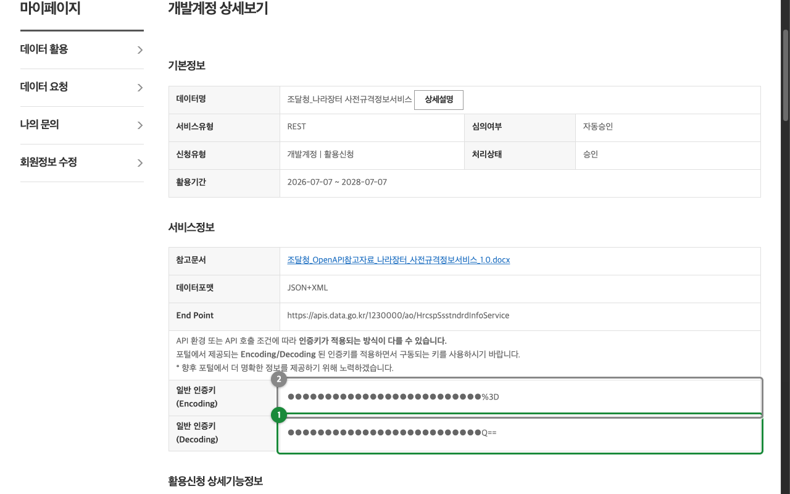

<!-- mcp-name: io.github.opendata-kr/narajangteo-prespec-mcp -->

# data.go.kr 인증키 발급 가이드

공공데이터포털(data.go.kr)이 처음인 분을 위한 그림 가이드다. 이 MCP 서버(`@opendata-kr/narajangteo-prespec-mcp`)를 쓰려면 공공데이터포털에서 **나라장터 사전규격정보서비스**를 활용신청하고, 발급받은 인증키를 서버 설정에 넣어야 한다.

> [!IMPORTANT]
> **서비스키를 어딘가에서 발급받았다고 바로 되는 게 아니다.**
> 공공데이터포털 인증키는 계정당 하나이고 여러 API가 그 키 하나를 함께 쓴다. 그렇지만 **각 API는 저마다 따로 활용신청을 해서 `[승인]`을 받아야** 그 API 주소에서 인증된다. 즉 키를 가지고 있어도 **나라장터 사전규격정보서비스**를 활용신청하지 않았다면 이 서버의 호출은 인증 오류(결과코드 30)로 막힌다. 형제 서비스(입찰공고·낙찰 등)를 신청했더라도 사전규격은 별도로 신청해야 한다.

이 문서는 공공데이터포털에 **이미 로그인한 상태**를 전제로 한다. 계정이 없으면 먼저 [공공데이터포털](https://www.data.go.kr)에서 회원가입과 로그인을 마친다.

전체 흐름은 네 단계다.

1. 서비스 찾기 → 2. 활용신청 → 3. 승인 확인 → 4. 인증키(Decoding) 복사

---

## 1. 서비스 찾기

[공공데이터포털](https://www.data.go.kr)에서 **나라장터 사전규격정보서비스**를 검색해 **조달청\_나라장터 사전규격정보서비스**를 찾는다.

1. **오픈 API** 탭을 누른다.
2. 제공기관이 **조달청**인 **조달청\_나라장터 사전규격정보서비스**를 찾는다(①). 이름이 비슷한 서비스(입찰공고·낙찰·계약 등)가 많으니 **사전규격정보서비스**가 맞는지 확인한다.
3. 그 줄의 **활용신청** 버튼을 누른다(②). (제목을 눌러 상세 페이지로 들어가도 된다.)

바로 상세 페이지를 열려면 아래 링크를 써도 된다: <https://www.data.go.kr/data/15129437/openapi.do>

## 2. 활용신청

상세 페이지 오른쪽 위의 **활용신청** 버튼을 누른다.

1. 서비스 이름이 **조달청\_나라장터 사전규격정보서비스**가 맞는지 확인한다(①).
2. **활용신청** 버튼을 누른다(②).

버튼을 누르면 신청 폼이 나온다. 위에서 아래로 **활용목적 → 첨부파일 → 상세기능정보 → 라이선스 표시** 순서다. 항목마다 무엇을 하는지 정리했다.

1. **활용목적** (필수): 라디오 버튼에서 하나를 고르고, **바로 아래 입력란(250자)에도 목적을 직접 적는다.** 라디오와 입력란이 둘 다 필수라, 입력란을 비우면 `활용목적을 입력해주세요`가 빨간 글씨로 뜨고 신청이 넘어가지 않는다.
   - **라디오**: 웹 사이트 개발 / 앱개발(모바일·솔루션 등) / 기타 / 참고자료 / 연구(논문 등) 중 하나. 데이터를 살펴보거나 이 MCP 같은 도구에 붙여 쓰는 정도면 **참고자료**를 고른다.
   - **입력란**: 목적을 한 줄로 적는다. 예: `narajangteo-prespec-mcp(https://github.com/opendata-kr/narajangteo-prespec-mcp)에서 사전규격 조회에 사용`
2. **첨부파일** (없음): 이 서비스는 위치정보를 다루지 않으므로 첨부할 파일이 없다. 그냥 넘어간다. 첨부파일은 위치정보를 포함한 서비스를 신청하는 사업자가 '위치기반서비스사업신고필증'을 낼 때만 쓴다.
3. **상세기능정보** (그대로 둠): 이 API가 제공하는 오퍼레이션 목록이 **기본으로 모두 체크**되어 있다. 손대지 말고 전부 선택된 채로 둔다. 사전규격정보서비스는 물품·외자·용역·공사 업무별로 전체목록·기관별·품목별·검색조건·규격서의견 오퍼레이션을 제공한다.
4. **라이선스 표시** (필수): **이용허락범위: 제한 없음**과 **동의합니다**에 체크한다.

다 채웠으면 맨 아래 **신청** 버튼을 누른다. 이 서비스는 **자동승인**이라 제출하면 곧바로 `[승인]` 상태가 된다. 별도 심사를 기다리지 않아도 된다.

## 3. 승인 확인

**마이페이지 → 활용신청 현황**에서 방금 신청한 서비스가 `[승인]` 상태인지 확인한다. 이 단계가 앞의 경고에서 말한 핵심이다. 이 목록에 이 API가 `[승인]`으로 있어야 인증키가 이 API에서 작동한다.

1. 상태가 `[승인]`인지 확인한다(①).
2. **조달청\_나라장터 사전규격정보서비스**가 목록에 있는지 확인한다(②).

## 4. 인증키(Decoding) 복사

목록에서 서비스 이름을 눌러 **개발계정 상세보기**로 들어간다. **서비스정보**에 인증키가 두 벌 나온다.

> [!WARNING]
> 인증키가 **Encoding**과 **Decoding** 두 가지로 나온다. 이 서버에는 반드시 **Decoding(원본)** 키를 넣는다.
> - **일반 인증키(Decoding)**(①): 끝이 `==`. **이걸 복사한다.**
> - **일반 인증키(Encoding)**(②): 끝이 `%3D%3D`처럼 URL 인코딩된 형태. 이걸 넣으면 이중 인코딩으로 **인증 오류**(결과코드 30)가 난다.

복사한 **Decoding** 키를 이 서버 설정의 `DATA_GO_KR_SERVICE_KEY`에 넣으면 된다. 설정 방법은 [README의 MCP 클라이언트 설정](../README.md#mcp-클라이언트-설정)을 참고한다.

---

## 잘 안 될 때

- **인증 오류(결과코드 30)**: 두 가지를 확인한다. ① **Decoding** 키가 아니라 **Encoding** 키를 넣지 않았는지, ② 3단계 목록에서 **나라장터 사전규격정보서비스**가 `[승인]` 상태로 있는지. 다른 API용으로 발급한 키만 있고 이 API를 활용신청하지 않았다면 이 오류가 난다.
- **키를 다시 보고 싶을 때**: 마이페이지 → 활용신청 현황 → 서비스 이름 → 개발계정 상세보기에서 언제든 다시 확인한다.
- 인증키는 같은 계정으로 활용신청한 다른 data.go.kr API에도 그대로 쓰인다. 그렇지만 새 API를 쓸 때마다 그 API의 활용신청을 따로 해야 한다.
